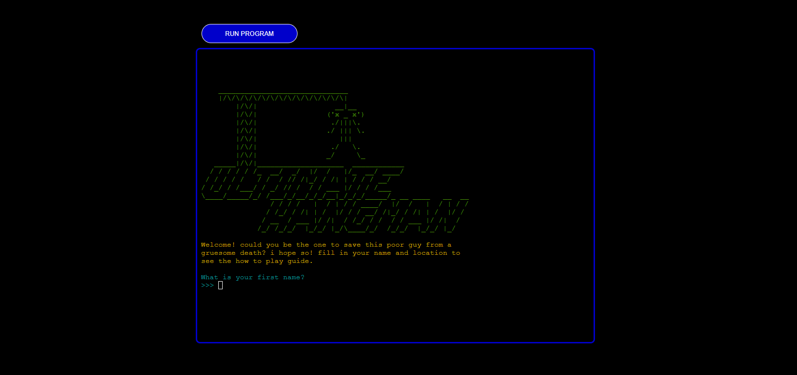

# **Ultimate Hangman**

## **Overview**

This hangman game is based on the original hangman game but with extra features: leaderboards, difficulty modes and word definition tokens. This game is based inside a mock terminal deployed via Heroku.

The game's challenging nature alongside with the leaderboard system creates a competitive environment with players, each trying to get a higher score and represent their Country/City.

[Click here to go to the deployed project](https://ultimate-hangman-063344ed324f.herokuapp.com/)

## **Table of Contents**

- [**Ultimate Hangman**](#ultimate-hangman)
  - [**Overview**](#overview)
  - [**Table of Contents**](#table-of-contents)

## **How to Play:**

### **_Selection of Game Modes:_**
