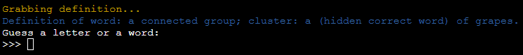

# **Ultimate Hangman**

## **Overview**

This hangman game is based on the original hangman game but with extra features: leaderboards, difficulty modes and word definition tokens. This game is based inside a mock terminal deployed via Heroku.

The game's challenging nature alongside the leaderboard system creates a competitive environment with players, each trying to get a higher score and represent their Country/City.

[Click here to go to the deployed project](https://ultimate-hangman-063344ed324f.herokuapp.com/)

## **Table of Contents**

- [**Ultimate Hangman**](#ultimate-hangman)
  - [**Overview**](#overview)
  - [**Table of Contents**](#table-of-contents)
  - [**How to Play**](#how-to-play)
    - [**Game Rules**](#game-rules)
    - [**Points System**](#points-system)
    - [**Selection of Game Modes**](#selection-of-game-modes)
    - [**How Players Win**](#how-players-win)
  - [**Planning Stage**](#planning-stage)
    - [**User Stories**](#user-stories)
    - [**Site Aims**](#site-aims)
    - [**How This Will Be Achieved**](#how-will-this-be-achieved)
    - [**Game Flow Chart**](#game-flow-chart)

## **How to Play:**

### **_Game Rules_**

1. You will have 7 attempts to guess the right word by guessing the word outright or guessing with letters.
2. If you guess wrong, hangman will start to build and if you have more than 15 points, they will be deducted by 10 each time.
3. If the attempts reach 0, the hangman will be killed and you will lose the game.
4. Each time you play and your attempts reach 3 you will get a hint token, if you use it you will get the definition of the word but also 25 points will be deducted if you have more than 25 already.

### **_Points System_**

- (+ 25 points) each time you guess a letter right.
- (+ 100 points) if you guess the word right with half of the word exposed.
- (+ 750 points) if you guess the word right without revealing the first half of the word already
- (- 10 points) if you guess a letter wrong, only applies if your points are more than 15 already.
- (- 100% points), you will lose all your points if you guess the word wrong.

### **_Selection of Game Modes:_**

The player has 3 options for game modes: Easy mode, Intermediate mode and Hard mode. All words used for these modes are stored in the RandomWord class:

- Easy mode words are chosen by iterating through the list and using list comprehension, only words with less than 6 letters are chosen, then randomly picked to be used for the hangman word.

- Intermediate mode words are chosen by iterating through the list and using list comprehension, only words with more than 6 but less than 8 letters are chosen, then randomly picked to be used for the hangman word.

- Hard mode words are chosen by iterating through the list and using list comprehension, only words with more than 8 letters are chosen, then randomly picked to be used for the hangman word.

### **_How Players Win:_**

1. Correctly guessing all the letters in the hangman word.
2. Correctly guessing the hangman word outright.

# **Planning Stage**

## **_User Stories:_**

As a user, I want to be able to:

1. Have a clear way of seeing the game rules and points system.
2. Choose the game mode I want and also switch between them when I want to.
3. Play the game without any errors along the way.
4. Have my game data display on the leaderboard when I win.

## **_Site Aims:_**

The site aims to:

1. Display appropriate responses to any type of input from the user.
2. Keep the game going regardless of user input.
3. Make the instructions very clear, preventing the player from searching external sources for relevant information.
4. Give the user the satisfaction of displaying their score on the leaderboard, giving them a sense of accomplishment.

## **_How Will This Be Achieved:_**

To achieve the above, the site will:

1. Provide a welcome screen with the game logo in ASCII art.
2. Anytime the user inputs something that is not recognized as a valid input, handle it with a clear message on what the user did and should not do to proceed.
3. Not have any bugs that will hinder the player's experience resulting in an unfair game.
4. Successfully handle and display error messages when an API request is not successfully sent or retrieved.

## **_Game Flow Chart:_**

To understand the steps required to program the game, I created the below flowchart using [lucid charts](https://www.lucidchart.com/).

What the colors mean:

- Green: Start something
- Blue: Display to terminal
- Yellow: Logical action
- Red: User input required

# **Features**

## **Welcome Screen:**

From the welcome screen, the user sees:

- The logo of the ultimate hangman game
- The welcome message
- The following inputs:
  - First name
  - Location (Country or City)

## **How to Play Guide:**

From the how-to-play guide screen, the user sees:

- ASCII art displaying the game rules and points system
- A message suggesting the player read the how-to-play guide before playing
- The following options:
  - Type A to choose the game mode
  - Type B to go back to the welcome screen to re-enter their name and location

## **Game Modes:**

From the game modes screen, the user sees:

- ASCII art displaying the game modes
- The following options:
  - Type A for Easy mode
  - Type B for Intermediate mode
  - Type C for Hard mode

## **Game Screen**

From the game screen, the user sees:

- ASCII art displaying the build stage of the hangman
- Game hint message section, this section's text displays various messages based on what the user does, for example:
  - When the player first starts the game they see a "Good luck" message
  - If the player does not enter either a letter or a word (for example: numbers or symbols..) they see "Your input is neither a letter nor a word, try again."
  - If the player has guessed a word, but it is guessed already they see "You have guessed the word {user_input} already."
  - If they guess a word but it's not the correct word they see "Wrong! {user_input} is not the word"
  - If they guessed a letter, but it's guessed already they see "You have guessed the letter '{user_input}' already"
  - If they guessed a letter and it's in the correct word they see "Correct! the letter '{user_input}' is in the word!"
  - If they guessed a letter, but it's wrong they see "Wrong! the letter {user_input} is not in the word"
- Wrong guesses section, this section displays a list of wrong guesses, by combining wrongly guessed letters and words
- The hangman word but its hidden with underscores, once the player starts guessing correctly they will have visual conformation of their correct guess because it will be displayed
- The amount of attempts the player has left, the number starts from 7
- An input field prompting the player to either input a letter or a word

### **_Game screen 6 attempts left_**

When the player has 6 attempts left, the following happens:

- The hangman stage builds showing the rope
- Wrong guesses get appended to the wrong guesses section
- If the player had more than 15 points, guessed a letter and it was a wrong guess then 10 points will be deducted
- If the player had any points, guessed a word and it was incorrect then 100% of the points will be deducted
- The player will see that they have 6 attempts left

### **_Game screen 5 attempts left_**

When the player has 5 attempts left, the following happens:

- The hangman stage builds revealing the head
- Wrong guesses get appended to the wrong guesses section
- If the player had more than 15 points, guessed a letter and it was a wrong guess then 10 points will be deducted
- If the player had any points, guessed a word and it was incorrect then 100% of the points will be deducted
- The player will see that they have 5 attempts left

### **_Game screen 4 attempts left_**

When the player has 4 attempts left, the following happens:

- The hangman stage builds by opening one eye and revealing the body
- The ASCII art will turn yellow
- Wrong guesses get appended to the wrong guesses section
- If the player had more than 15 points, guessed a letter and it was a wrong guess then 10 points will be deducted
- If the player had any points, guessed a word and it was incorrect then 100% of the points will be deducted
- The player will see that they have 4 attempts left

### **_Game screen 3 attempts left_**

When the player has 3 attempts left, the following happens:

- The hangman stage builds by opening both eyes and revealing his right arm
- Wrong guesses get appended to the wrong guesses section
- If the player had more than 15 points, guessed a letter and it was a wrong guess then 10 points will be deducted
- If the player had any points, guessed a word and it was incorrect then 100% of the points will be deducted
- The player will see that they have 3 attempts left
- The player gets to choose if they want to use the hint token, in doing so they will lose 25 points if they have more than 25 already, but they get to see the definition of the word, which gives them a great advantage. If they choose no they will be asked to use the hint token again till the game is lost

#### **_The Player uses the hint token_**

When the player has 3 or fewer attempts remaining and they use their hint token, the following happens:

- They get a message saying the definition is being grabbed
- The definition of the word is displayed. If the definition of the word requires the use of the word then it's replaced with (hidden correct word)
- The player is then prompted to enter a guess

### **_Game screen 2 attempts left_**

When the player has 2 attempts left, the following happens:

- The hangman stage builds further and reveals the left arm. Underneath the hangman, the text "TOO CLOSE FOR COMFORT" appears
- Wrong guesses get appended to the wrong guesses section
- If the player had more than 15 points, guessed a letter and it was a wrong guess then 10 points will be deducted
- If the player had any points, guessed a word and it was incorrect then 100% of the points will be deducted
- The player will see that they have 2 attempts left
- The input prompting the user to input a letter or a word turns red and "Hurry!" is added

### **_Game screen 1 attempt left_**

When the player has 1 attempt left, the following happens:

- The hangman stage builds further and reveals the right leg. Underneath the hangman, the text changes to "1 MORE AND HE'S A GONER"
- Wrong guesses get appended to the wrong guesses section
- If the player had more than 15 points, guessed a letter and it was a wrong guess then 10 points will be deducted
- The player will see that they have 1 attempt left

## **Game End Screens:**

### **_Game Win Screen:_**

When the player wins, they see the following:

- ASCII art of the hangman getting freed from the rope and a "YOU WON !" message appears
- Congratulations message of "Amazing job! You saved him!" appears
- A message saying the leaderboard has been updated
- Displaying the hangman word
- The points they accumulated during the game
- Options to Play again, see leaderboards or exit the game

### **_Game Lose Screen:_**

When the player loses, they see the following:

- ASCII art of the hangman being hanged with a message saying "YOU LOST!"
- A message of "Better luck next time, my dude is dead!" appears
- Displaying the hangman word
- The points they accumulated during the game
- Options to Play again, see leaderboards or exit the game

