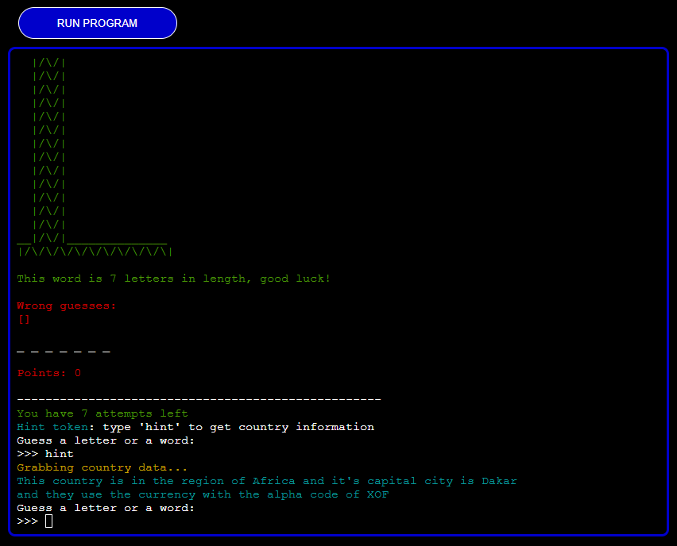

# **Ultimate Hangman**

## **Overview**

This hangman game is based on the original hangman game but with extra features: leaderboards, difficulty modes and word definition tokens. This game is based inside a mock terminal deployed via Heroku.

The game's challenging nature alongside the leaderboard system creates a competitive environment with players, each trying to get a higher score and represent their Country/City.

[Click here to go to the deployed project](https://ultimate-hangman-063344ed324f.herokuapp.com/)

## **Table of Contents**

- [**Ultimate Hangman**](#ultimate-hangman)
  - [**Overview**](#overview)
  - [**Table of Contents**](#table-of-contents)
  - [**How to Play**](#how-to-play)
    - [**Game Rules**](#game-rules)
    - [**Points System**](#points-system)
    - [**Selection of Game Modes**](#selection-of-game-modes)
    - [**How Players Win**](#how-players-win)
  - [**Planning Stage**](#planning-stage)
    - [**User Stories**](#user-stories)
    - [**Site Aims**](#site-aims)
    - [**How This Will Be Achieved**](#how-will-this-be-achieved)
    - [**Game Flow Chart**](#game-flow-chart)
  - [**Game modes**](#game-modes)
  - [**Game screen**](#game-screen)
    - [**When the player uses the hint token**](#when-the-player-uses-the-hint-token)
      - [**Regular mode**](#regular-mode)
      - [**Country mode**](#country-mode)
    - [**Game screen 6 attempts left**](#game-screen-6-attempts-left)
    - [**Game screen 5 attempts left**](#game-screen-5-attempts-left)
    - [**Game screen 4 attempts left**](#game-screen-4-attempts-left)
    - [**Game screen 3 attempts left**](#game-screen-3-attempts-left)
    - [**Game screen 2 attempts left**](#game-screen-2-attempts-left)
    - [**Game screen 1 attempts left**](#game-screen-1-attempts-left)
    - [**Game end screen**](#game-end-screens)
      - [**Game win screen**](#game-win-screen)
      - [**Game lose screen**](#game-lose-screen)
    - [**Exit game screens**](#exit-game-screens)
  - [**Future enhancements**](#future-enhancements)
    - [**Ranked mode**](#ranked-mode)
    - [**Custom modes**](#custom-modes)
    - [**Audio**](#audio)
  - [**Data model**](#data-model)
    - [**Overview of classes**](#overview-of-classes)
    - [**Logic flow**](#logic-flow)
      - [**Setup phase**](#setup-phase)
      - [**Game phase**](#game-phase)
  - [**Testing phase**](#testing-phase)
  - [**Libraries**](#libraries)
    - [**Python standard libraries**](#python-standard-library)
      - [**time**](#time)
      - [**sys**](#sys)
      - [**os**](#os)
    - [**3rd party libraries**](#3rd-party-libraries)
      - [**colorama**](#colorama)
      - [**dotenv**](#dotenv)
      - [**gspread**](#gspread)
      - [**requests**](#requests)
      - [**google auth**](#google-auth)
  - [**Deployment to heroku**](#deployment-to-heroku)
  - [**Honorable mentions**](#honorable-mentions)

## **How to Play:**

### **_Game Rules_**

1. You will have 7 attempts to guess the right word by guessing the word outright or guessing with letters.
2. If you guess wrong, hangman will start to build and if you have more than 15 points, they will be deducted by 10 each time.
3. If the attempts reach 0, the hangman will be killed and you will lose the game.
4. Each time you play and your attempts reach 3 you will get a hint token, if you use it you will get the definition of the word but also 25 points will be deducted if you have more than 25 already.

### **_Points System_**

- (+ 25 points) each time you guess a letter right.
- (+ 100 points) if you guess the word right with half of the word exposed.
- (+ 750 points) if you guess the word right without revealing the first half of the word already
- (- 10 points) if you guess a letter wrong, only applies if your points are more than 15 already.
- (- 100% points), you will lose all your points if you guess the word wrong.

### **_Selection of Game Modes:_**

The player has 3 options for game modes: Easy mode, Intermediate mode and Hard mode. All words used for these modes are stored in the RandomWord class:

- Easy mode words are chosen by iterating through the list and using list comprehension, only words with less than 6 letters are chosen, then randomly picked to be used for the hangman word.

- Intermediate mode words are chosen by iterating through the list and using list comprehension, only words with more than 6 but less than 8 letters are chosen, then randomly picked to be used for the hangman word.

- Hard mode words are chosen by iterating through the list and using list comprehension, only words with more than 8 letters are chosen, then randomly picked to be used for the hangman word.

### **_How Players Win:_**

1. Correctly guessing all the letters in the hangman word.
2. Correctly guessing the hangman word outright.

# **Planning Stage**

## **_User Stories:_**

As a user, I want to be able to:

1. Have a clear way of seeing the game rules and points system.
2. Choose the game mode I want and also switch between them when I want to.
3. Play the game without any errors along the way.
4. Have my game data display on the leaderboard when I win.

## **_Site Aims:_**

The site aims to:

1. Display appropriate responses to any type of input from the user.
2. Keep the game going regardless of user input.
3. Make the instructions very clear, preventing the player from searching external sources for relevant information.
4. Give the user the satisfaction of displaying their score on the leaderboard, giving them a sense of accomplishment.

## **_How Will This Be Achieved:_**

To achieve the above, the site will:

1. Provide a welcome screen with the game logo in ASCII art.
2. Anytime the user inputs something that is not recognized as a valid input, handle it with a clear message on what the user did and should not do to proceed.
3. Not have any bugs that will hinder the player's experience resulting in an unfair game.
4. Successfully handle and display error messages when an API request is not successfully sent or retrieved.

## **_Game Flow Chart:_**

To understand the steps required to program the game, I created the below flowchart using [lucid charts](https://www.lucidchart.com/).

What the colors mean:

- Green: Start something
- Blue: Display to terminal
- Yellow: Logical action
- Red: User input required

# **Features**

## **Welcome Screen:**

From the welcome screen, the user sees:

- The logo of the ultimate hangman game
- The welcome message
- The following inputs:
  - First name
  - Location (Country or City)

## **How to Play Guide:**

From the how-to-play guide screen, the user sees:

- ASCII art displaying the game rules and points system
- A message suggesting the player read the how-to-play guide before playing
- The following options:
  - Type A to choose the game mode
  - Type B to go back to the welcome screen to re-enter their name and location

## **Game Modes:**

From the game modes screen, the user sees:

- ASCII art displaying the game modes
- The following options:
  - Type A for Easy mode
  - Type B for Intermediate mode
  - Type C for Hard mode
  - Type D for country mode

## **Game Screen**

From the game screen, the user sees:

- ASCII art displaying the build stage of the hangman
- Game hint message section, this section's text displays various messages based on what the user does, for example:
  - When the player first starts the game they see a message stating how many letters the word has "This word is (length of word) letters in length, good luck"
  - If the player does not enter either a letter or a word (for example: numbers or symbols..) they see "Your input is neither a letter nor a word, try again."
  - If the player has guessed a word, but it is guessed already they see "You have guessed the word {user_input} already."
  - If they guess a word but it's not the correct word they see "Wrong! {user_input} is not the word"
  - If they guessed a letter, but it's guessed already they see "You have guessed the letter '{user_input}' already"
  - If they guessed a letter and it's in the correct word they see "Correct! the letter '{user_input}' is in the word!"
  - If they guessed a letter, but it's wrong they see "Wrong! the letter {user_input} is not in the word"
- Wrong guesses section, this section displays a list of wrong guesses, by combining wrongly guessed letters and words
- The hangman word but its hidden with underscores, once the player starts guessing correctly they will have visual conformation of their correct guess because it will be displayed
- The amount of attempts the player has left, the number starts from 7
- Optional hint token, when the player wants to use their hint token, all they have to do is type "hint" during the game, and they get the definition of the hangman word
- An input field prompting the player to either input a letter or a word

### **When the Player uses the hint token**

When the player types "hint" the following happens:

#### **_Regular mode_**

When the player is playing the following game modes: Easy mode, intermediate mode or hard mode, they see the following:

- A text saying the definition is being grabbed
- The definition itself, without revealing the hangman word. Because to describe a word, some responses came back with the hangman word itself so to hide this I replaced the word in the definition with (hidden correct word)

#### **_Country mode_**

When the player is playing the country mode, they see the following:

- A text saying the country data is being grabbed
- The country data itself, the information given to the player when they use this hint is the region the country is in, the capital city and the country's currency alpha code.

### **_Game screen 6 attempts left_**

When the player has 6 attempts left, the following happens:

- The hangman stage builds showing the rope
- Wrong guesses get appended to the wrong guesses section
- If the player had more than 15 points, guessed a letter and it was a wrong guess then 10 points will be deducted
- If the player had any points, guessed a word and it was incorrect then 100% of the points will be deducted
- The player will see that they have 6 attempts left

### **_Game screen 5 attempts left_**

When the player has 5 attempts left, the following happens:

- The hangman stage builds revealing the head
- Wrong guesses get appended to the wrong guesses section
- If the player had more than 15 points, guessed a letter and it was a wrong guess then 10 points will be deducted
- If the player had any points, guessed a word and it was incorrect then 100% of the points will be deducted
- The player will see that they have 5 attempts left

### **_Game screen 4 attempts left_**

When the player has 4 attempts left, the following happens:

- The hangman stage builds by opening one eye and revealing the body
- The ASCII art will turn yellow
- Wrong guesses get appended to the wrong guesses section
- If the player had more than 15 points, guessed a letter and it was a wrong guess then 10 points will be deducted
- If the player had any points, guessed a word and it was incorrect then 100% of the points will be deducted
- The player will see that they have 4 attempts left

### **_Game screen 3 attempts left_**

When the player has 3 attempts left, the following happens:

- The hangman stage builds by opening both eyes and revealing his right arm
- Wrong guesses get appended to the wrong guesses section
- If the player had more than 15 points, guessed a letter and it was a wrong guess then 10 points will be deducted
- If the player had any points, guessed a word and it was incorrect then 100% of the points will be deducted
- The player will see that they have 3 attempts left
- The player gets to choose if they want to use the hint token, in doing so they will lose 25 points if they have more than 25 already, but they get to see the definition of the word, which gives them a great advantage. If they choose no they will be asked to use the hint token again till the game is lost

### **_Game screen 2 attempts left_**

When the player has 2 attempts left, the following happens:

- The hangman stage builds further and reveals the left arm. Underneath the hangman, the text "TOO CLOSE FOR COMFORT" appears
- Wrong guesses get appended to the wrong guesses section
- If the player had more than 15 points, guessed a letter and it was a wrong guess then 10 points will be deducted
- If the player had any points, guessed a word and it was incorrect then 100% of the points will be deducted
- The player will see that they have 2 attempts left
- The input prompting the user to input a letter or a word turns red and "Hurry!" is added

### **_Game screen 1 attempt left_**

When the player has 1 attempt left, the following happens:

- The hangman stage builds further and reveals the right leg. Underneath the hangman, the text changes to "1 MORE AND HE'S A GONER"
- Wrong guesses get appended to the wrong guesses section
- If the player had more than 15 points, guessed a letter and it was a wrong guess then 10 points will be deducted
- The player will see that they have 1 attempt left

## **Game End Screens:**

### **_Game Win Screen:_**

When the player wins, they see the following:

- ASCII art of the hangman getting freed from the rope and a "YOU WON !" message appears
- Congratulations message of "Amazing job! You saved him!" appears
- A message saying the leaderboard has been updated
- Displaying the hangman word
- The points they accumulated during the game
- Options to Play again, see leaderboards or exit the game

### **_Game Lose Screen:_**

When the player loses, they see the following:

- ASCII art of the hangman being hanged with a message saying "YOU LOST!"
- A message of "Better luck next time, my dude is dead!" appears
- Displaying the hangman word
- The points they accumulated during the game
- Options to Play again, see leaderboards or exit the game

## **Exit Game Screens:**

If the player exit's the game but _has not_ won a game before doing so, they see the following:

If the player exit's the game and _has_ won a game before doing so, they see the following:

# **Future-Enhancements**

### **_Ranked mode_**

Like the idea I had for my last project, I believe a ranked system for this project would have taken it to the next level. This is how it could be implemented:

- On the welcome screen, ranked modes could be mentioned to get the user's attention.
- During the game modes screen, I could first give the player the option of either playing ranked or normal.
- Once the player chooses the ranked mode, they will be shown each rank stage, for example: Bronze, Silver, Gold, Platinum and Diamond. Each of these stages rewards more than the previous one.
- Reward ideas: Badges (a badge of the rank stage the player finished the season on), In-game currency, Custom themes or Physical rewards such as ultimate hangman themed merchandise or gift cards.

### **_Custom modes_**

The idea of custom game modes makes me excited and it is something I would come back to try out. This is how it could be implemented:

- Add a section to the game modes screen that gives the player the additional options of either choosing custom game modes to play created by other players, or creating a game mode.
- The data could be stored in a database and later accessed easily too, accessing the data through the words.py file which handles the current game mode words already.
- Custom game mode leaderboards could also be created to see how players performed in those modes, and have the game mode creator something to be excited about to see each time they check it.

### **_Audio_**

Audio functionality would be great for this game and could be implemented in specific situations. This is how it could be implemented:

- Import audio files such as: A high pitched 'ting' sound, A low pitched 'du-du-duuu' sound.
- These sounds could be played in the following situations: When the player gets a letter correct or incorrect or when the player wins or loses.

# **Data Model**

### **Overview of classes**

For this project, I have opted to use OOP(Object Oriented Programming). The game consists of 7 classes:

1. Game
2. Player
3. HintToken
4. Leaderboard
5. RandomWord

The following classes are being used by more than 1 class so to avoid repetition I placed them in 1 file:

1. ClearTerminalMixin
2. AsciiArtMixin

### **Logic Flow**

#### **_Setup Phase_**

The game object gets created in the global scope and calls the collect_info method within the Player class using dot notation. The player is then greeted with a welcome screen displaying a welcome message. Within this screen, I used input fields to collect the player's name and location to be used later on. Once the player has entered their name and location, the how_to_play method is called within the Game class to display the how-to-play guide to the player, the player is also encouraged to read the guide to have a better understanding of the game. They are then met with 2 options, choose game mode or go back to change and update their name and location. Once the player chooses the choose game mode option they see the following game modes: Easy mode, Intermediate mode, Hard mode and Country mode. Upon clicking either one of the game modes the play method is called from within the Game class and the following happens: Depending on which game mode the player chooses the game_modes method within the RandomWord class is called to select the hangman word, The timer starts to keep track of how much time it takes the player to complete a game, the value of game_hint_message is set to "This word is (the number of letters in the hangman word) in length, good luck".

#### **_Game Phase_**

Now that the hangman word is chosen, the timer has started and the game_hint_message is set, the following things will be printed to the console over and over again until the game ends: The current hangman stage the player is on, the game_hint_message, the wrong guesses made by the player, the display word (which is the amount of letters in the hangman word multiplied by underscores), the amount of points the player has, the amount of attempts the player has left, hint token option (only visible if the player has not used the hint token already), and a prompt to tell the player to type a letter or a word.

# **Testing Phase**

I have written my testing in a different file for both during-development and post-development called [TESTING.md](TESTING.md).

# **Libraries**

For this project to function, I imported the following libraries:

## **Python standard library**

### **_time:_**

I included the time module from the Python standard library in this project to manage time-related operations. Specifically for the game class, to calculate how much time the player spent in a game.

### **_sys:_**

I integrated the sys module from the Python standard library into this project to interact with the Python interpreter. Specifically the exit function, to terminate the terminal when the user decides to exit the game.

### **_os:_**

A system employed alongside the clear/cls command to reset the console, preventing users from being inundated with outdated data from prior sessions.

## **3rd party libraries**

### **_colorama:_**

Colorama is a Python library that simplifies colored text output in the terminal. It allows me to easily add colored text to my console applications, making them more visually appealing and enhancing the user experience. With just a few lines of code, I can apply different colors to my text, making this terminal-based project more dynamic and appealing.

### **_dotenv:_**

I used the dotenv library in my project to securely manage sensitive information, such as my API key, stored in an environment file (env.py). This allows me to keep sensitive data separate from my codebase and easily access it in other files, promoting better security practices and simplifying configuration management.

### **_gspread:_**

I incorporated the gspread library into this project to seamlessly interact with Google Sheets. This library facilitates easy integration, providing a straightforward way to access and manipulate data within Google Sheets.

### **_requests:_**

I opted for the requests library in this project to simplify HTTP requests. This library streamlines communication with APIs and web services, making it convenient to send and receive data.

### **_google auth:_**

I used the Google auth library for my project specifically to leverage its Credentials module. This allows me to securely authenticate and authorize access to the Google API.

# **Deployment to Heroku**

The project was deployed to [Heroku](https://www.heroku.com) using the following steps:

1. _Log in to Heroku_ or create an account if required.
2. _Click on the dashboard_ from the hamburger menu on the top right to be navigated to the apps page.
3. _Click the new_ button on the top right of the page.
4. _Select the "create new app"_ option.
5. _Enter_ the app name. I named mine ultimate-hangman (this has to be unique).
6. _Once Heroku accepts the app name_ select your region.
7. Click the purple _Create app button_ when you are ready to proceed.
8. This will bring you to the project _Deploy_ tab. From here, navigate to the _settings tab_ and scroll down to the _Config Vars_ section.
9. _Click_ the button labeled _Reveal \_Config Vars_, _Enter_ the key as Port, the Value as 8000 and _Click the add button_.
10. Scroll down to the _buildpacks section_ of the settings page, click the button labeled Add buildpack, select Python, and click _Save Changes_.
11. _Repeat step 10_ but this time add node.js instead of python.
    - Remember to keep the buildpacks in the correct order, Python first and Node second.
12. _Scroll back to the top_ of the settings page, and navigate to the _Deploy_ tab.
13. From the deploy tab select _Github as the deployment_ method.
14. _Confirm_ you want to connect to GitHub.
15. _Search_ for the repository name and _click the connect button_ next to the intended repository.
16. From the bottom of the deploy page _select your preferred deployment type_ by following one of the steps below:
    - Clicking either "Enable Automatic Deploys" for automatic deployment when you push updates to GitHub.
    - Select the correct branch for deployment from the drop-down menu and click the "Deploy Branch" button for manual deployment.

# **Honorable mentions**

These awesome people helped me in the process of making this project, so I will mention them below in no particular order:

- [David Bowers](https://github.com/dnlbowers) - David is an amazing mentor and I could not ask for more. He has helped me on my previous 2 projects (which received a distinction grade due to his help) and he has helped me a lot on this one too, guided me to take an OOP (Object Oriented Programming) approach which was challenging but also very fulfilling when I learned I could do it.

- [Lino Bollansee](https://github.com/linobollansee) - Amazing help to me towards the end of the project, helped point out the many errors I had, which may not have been resolved if they had not been mentioned by Lino.

- [Dajana Isbaner] - Great help to me, helped point out bugs in the project such as input errors and the terminal not being fully wiped after every loop of the game.

- [Niclas Hugdahl](https://github.com/NiclO1337) - Niclas was also a great help to me in the project by pointing out the quality of life changes I could have made for the project which I implemented swiftly, these changes improved my project so I am grateful to him.

- [James Evans](https://www.linkedin.com/in/james-evans-682ba29b/) - James was also really helpful in improving the contrast of some texts that were hard to see by players who might have had low brightness settings enabled on their display.
