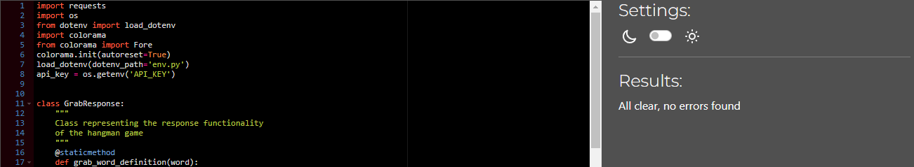

# **Testing**

## **Table of Contents**

- [**Testing**](#testing)
  - [**Table of contents**](#table-of-contents)

## **Manual testing:**

I performed manual testing throughout this project in the following ways:

### **_PEP8 Python Linter:_**

Below are screenshots of the results i got back from Python linter on all python files:

#### **_run.py_**

#### **_game.py_**

#### **_words.py_**

#### **_response.py_**

#### **_hinttoken.py_**

#### **_mixins.py_**

#### **_leaderboard.py_**

