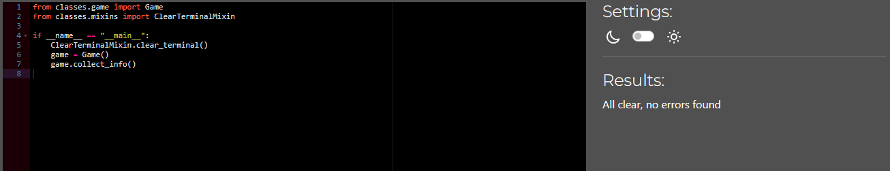

# **Testing**

## **Table of Contents**

- [**Testing**](#testing)
  - [**Table of contents**](#table-of-contents)
  - [**Manual testing**](#manual-testing)
    - [**PEP8 python linter**](#pep8-python-linter)
    - [**Game play**](#game-play)
    - [**Inputs**](#inputs)
  - [**Bugs and fixes**](#bugs-and-fixes)

## **Manual testing:**

I performed manual testing throughout this project in the following ways:

### **_PEP8 Python Linter:_**

Below are screenshots of the results i got back from Python linter on all python files:

#### **_run.py_**

#### **_game.py_**

#### **_words.py_**

#### **_response.py_**

#### **_hinttoken.py_**

#### **_mixins.py_**

#### **_leaderboard.py_**

### **_Game play:_**

Throughout development, I extensively tested the game in the Visual Studio Code terminal and played multiple rounds in the Code Institute terminal template. This dual-testing approach ensured compatibility and identified potential issues before each deployment to Heroku, guaranteeing a robust and reliable user experience.

### **_Inputs:_**

In the input sections of this project, I have thoroughly tested for potential errors arising from player input. I have specifically addressed scenarios where errors could occur, such as entering a number when a string is required and handling special characters. To ensure robust error handling, I've implemented comprehensive input validation for all user inputs.

Moreover, I've incorporated a proactive approach to prevent unintended issues, including the detection and handling of "Ctrl + C" inputs. By placing try and except statements, I've effectively safeguarded the project against unexpected interruptions caused by user actions like copying or halting the program.

## **_Bugs and fixes:_**

1. Intended Outcome: - Display the definition of the hangman word without displaying the hangman word itself.

- Issue Found:
  - Initially i would just try and use the filter function to find the hangman word and filter it out, but this would lead to weird sentences that did not make sense as a result of removing the hangman word entirely.
- Causes:
  - I was not familiar with the replace function yet and how easy it was to work with.
- Solution Found:
  - I used the replace function instead of the filter function, by doing this all i had to do was place the hangman word as the first argument in the function and the API response as the second argument, this way if the hangman word is detected within the definition, it will be replaced with (hidden correct word).

2. Intended Outcome: - To have the hangman word be stored in the **init** function of the game class, so it could be used on all the functions in the class.

- Issue Found:
  - Because the hangman word was generated by the RandomWord class's game_modes function, and also because the hangman word was changed again within the choose_game_mode function in the Game class, I found that once the player started a game, the display_word attribute would often generate either more or less underscores than there was letters in the actual hangman word.
- Causes:
  - The cause of this was because i did not update both the hangman_word attribute and display_word attribute when the player chose a game mode.
- Solution Found:
  - I made a function called handle_game_mode within the choose_game_mode function that took 2 arguments, mode and worksheet. In this function the display_word attribute and the hangman_word attribute were set to the word argument, and the word was passed to these attributes when they got called after the player chose a game mode, by doing this i assured that the amount of underscores displayed to the player was equal to the amount of letter there were in the hangman word.
