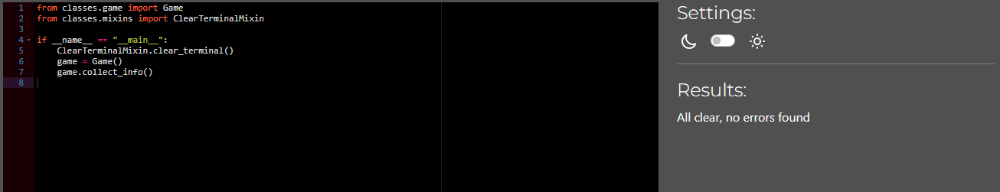
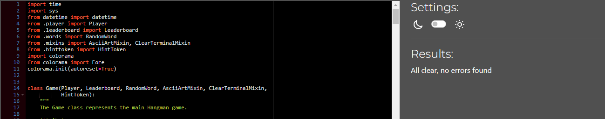
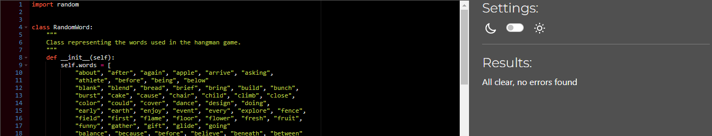
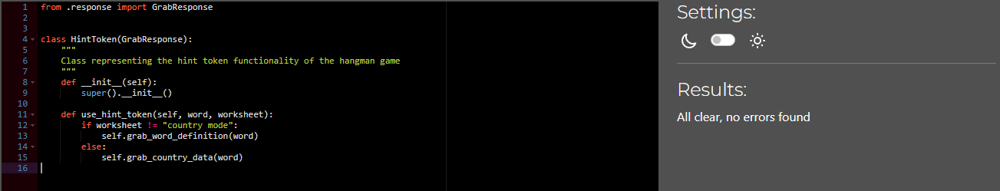
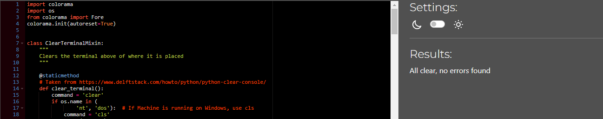
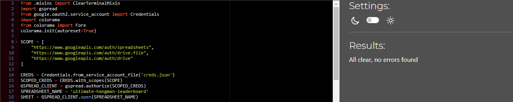
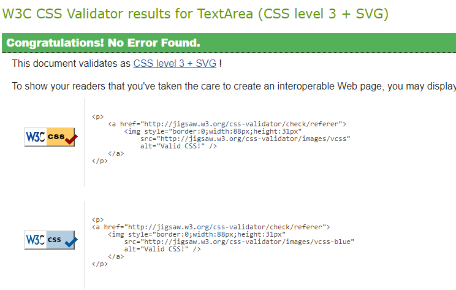

# **Testing**

## **Table of Contents**

- [**Testing**](#testing)
  - [**Table of contents**](#table-of-contents)
  - [**Manual testing**](#manual-testing)
    - [**PEP8 python linter**](#pep8-python-linter)
    - [**Game play**](#game-play)
    - [**Inputs**](#inputs)
    - [**Browser cross-compatibility**](#browser-cross-compatibility)
  - [**Bugs and fixes**](#bugs-and-fixes)
  - [**Post development testing**](#post-development-testing)
    - [**Validators**](#validators)
      - [**HTML - https://validator.w3.org/nu/**](#html---httpsvalidatorw3orgnu)
      - [**CSS - https://jigsaw.w3.org/css-validator/**](#css---httpsjigsaww3orgcss-validator)

## **Manual testing:**

I performed manual testing throughout this project in the following ways:

### **_PEP8 Python Linter:_**

Below are screenshots of the results i got back from Python linter on all python files:

#### **_run.py_**

#### **_game.py_**

#### **_words.py_**

#### **_response.py_**

#### **_hinttoken.py_**

#### **_mixins.py_**

#### **_leaderboard.py_**

### **_Game play:_**

Throughout development, I extensively tested the game in the Visual Studio Code terminal and played multiple rounds in the Code Institute terminal template. This dual-testing approach ensured compatibility and identified potential issues before each deployment to Heroku, guaranteeing a robust and reliable user experience.

### **_Inputs:_**

In the input sections of this project, I have thoroughly tested for potential errors arising from player input. I have specifically addressed scenarios where errors could occur, such as entering a number when a string is required and handling special characters. To ensure robust error handling, I've implemented comprehensive input validation for all user inputs.

Moreover, I've incorporated a proactive approach to prevent unintended issues, including the detection and handling of "Ctrl + C" inputs. By placing try and except statements, I've effectively safeguarded the project against unexpected interruptions caused by user actions like copying or halting the program.

### **_Browser cross-compatibility_**

During testing I used 5 different browsers to ensure cross-compatibility. The browsers used were:

- Chrome
- Firefox
- Firefox developer edition
- Opera GX
- Microsoft Edge

## **_Bugs and fixes:_**

1. Intended Outcome: - Display the definition of the hangman word without displaying the hangman word itself.

- Issue Found:
  - Initially i would just try and use the filter function to find the hangman word and filter it out, but this would lead to weird sentences that did not make sense as a result of removing the hangman word entirely.
- Cause:
  - I was not familiar with the replace function yet and how easy it was to work with.
- Solution Found:
  - I used the replace function instead of the filter function, by doing this all i had to do was place the hangman word as the first argument in the function and the API response as the second argument, this way if the hangman word is detected within the definition, it will be replaced with (hidden correct word).

2. Intended Outcome: - To have the hangman word be stored in the **init** function of the game class, so it could be used on all the functions in the class.

- Issue Found:
  - Because the hangman word was generated by the RandomWord class's game_modes function, and also because the hangman word was changed again within the choose_game_mode function in the Game class, I found that once the player started a game, the display_word attribute would often generate either more or less underscores than there was letters in the actual hangman word.
- Cause:
  - The cause of this was because i did not update both the hangman_word attribute and display_word attribute when the player chose a game mode.
- Solution Found:
  - I made a function called handle_game_mode within the choose_game_mode function that took 2 arguments, mode and worksheet. In this function the display_word attribute and the hangman_word attribute were set to the word argument, and the word was passed to these attributes when they got called after the player chose a game mode, by doing this i assured that the amount of underscores displayed to the player was equal to the amount of letter there were in the hangman word.

3. Intended Outcome: - To seamlessly handle all user inputs without breaking the game.

- Issue Found:
  - In an instance where the player might want to copy something on on the terminal, and they use the keyboard shortcut _ctrl + c_, the game would terminate.
- Cause:
  - There were no measures to prevent this in my input sections.
- Solution Found:
  - I used a try statement which was inside a while loop, the while loop was used to keep running the input fields until a valid input was obtained. In an event of an exception, the except block of the try statement would fire and let the user know that the keyboard shortcut they used which could break the game was not allowed, and display the input again.

4. Intended Outcome: Ensure that the game resets properly after completion, allowing the player to start a new game without any residual data from the previous one.

- Issue Found:
  - After completing a game and choosing to play again, some game attributes were not resetting correctly, leading to unexpected behavior in subsequent rounds.
- Cause:
  - Certain attributes related to game state and player data were not properly reset in the reset_game() method.
- Solution Found:
- Modified the reset_game() method to reset all relevant attributes, including game mode, guessed letters and words, hint tokens, and player score. This ensures that each new game starts with a clean slate and no carryover from previous rounds.

5. Intended Outcome: Implement a safeguard to prevent the game from crashing if the player exceeds the maximum allowed number of wrong guesses.

- Issue Found:
  - When the player exhausts all their attempts without guessing the word correctly, the game abruptly ends without providing any feedback or option to continue.
- Cause:
  - Lack of error handling for the scenario where the player runs out of attempts.
- Solution Found:
- Implemented a condition to check if the player's score reaches zero, indicating that they have no more attempts left. In this case, display a message informing the player that the game is over and provide options to play again, view leaderboards, or exit. This ensures a graceful handling of game termination scenarios and gives the player clear guidance on what to do next.

6. Intended Outcome: Prevent the game from displaying duplicate incorrect guesses in the list of wrong guesses.

- Issue Found:
  - When the player guesses the same incorrect letter multiple times, the letter gets added to the list of wrong guesses each time, resulting in duplicate entries.
- Cause:
  - Lack of check for duplicate entries in the list of wrong guesses.
- Solution Found:
  - Implemented a check to verify if the guessed letter is already in the list of wrong guesses before adding it. If the letter is already present, display a message informing the player that they've already guessed that letter incorrectly.

7. Intended Outcome: Ensure that the game handles unexpected input gracefully and provides clear instructions to the player in case of invalid input.

- Issue Found:
  - If the player enters a non-alphabetic character as input (e.g. a number or special symbol), the game crashes with an unhandled exception.
- Cause:
  - Lack of input validation and error handling for non-alphabetic characters.
- Solution Found:
  - Implemented input validation to check if the player's input consists of alphabetic characters only. If the input contains non-alphabetic characters, display a message informing the player that only letters are allowed and prompt them to enter a valid guess.

## **Post Development Testing**

### **Validators**

#### **_HTML_** - https://validator.w3.org/nu/

No issues found when using direct input regarding my changes, the changes i added are:

- Meta tags to improve the Lighthouse score of the site.
- Adjusted the col and row of the terminal.

#### **_CSS_** - https://jigsaw.w3.org/css-validator/

The style code was tested using direct input, with no issues found.

[return to README.md](README.md)
